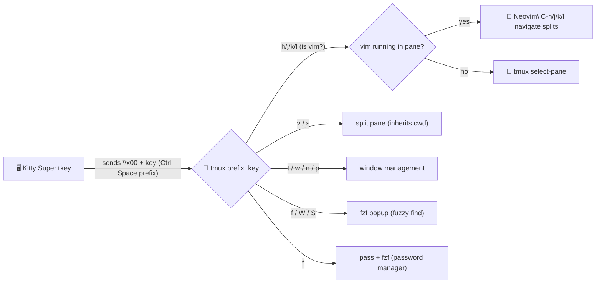

<p align="center">
  <strong><code>~/.config/tmux</code></strong>
  <br><br>
  <code>tmux, but the prefix key finally makes sense</code>
</p>

<p align="center">
  
  
  
  
  
  
</p>

**three-layer navigation. zero prefix dance.** kitty captures Super key, sends it as `Ctrl-Space` prefix to tmux, tmux routes it to neovim if vim is focused. one key does the right thing everywhere.

vim-native keybindings. fzf for everything. ADHD-friendly status bar with taskwarrior focus tracking, git sync status, and PR count. password manager in a popup. notifications when your builds finish. nested session support that actually works.

inspired by [samoshkin/tmux-config](https://github.com/samoshkin/tmux-config) and [artimux](https://github.com/tribhuwan-kumar/artimux). improved on both.

---

### `~/features`

- **Super key navigation** — `Super+h/j/k/l` moves between tmux panes and neovim splits seamlessly. no prefix, no thinking.
- **vim-tmux-navigator** — detects if the active pane is vim. same key, right behavior.
- **fzf everywhere** — fuzzy find windows, sessions, commands, keybindings, tmuxinator projects. all in popups.
- **ADHD focus dashboard** — status bar shows taskwarrior active task, timewarrior elapsed timer, tracking state. green when focused, red when you're slacking.
- **color-coded git** — branch icon changes color based on sync state. synced, ahead, behind, diverged — at a glance.
- **password manager** — `prefix+*` opens fzf popup over your `pass` store. copies to clipboard, auto-clears. nothing in history.
- **smart clipboard** — yank chain: `wl-copy` → `xsel` → `xclip` → OSC 52. works locally, over SSH, on wayland, on X11.
- **nested sessions** — `F12` disables local keys, passes everything to remote tmux. status grays out. press again to restore.
- **auto-hide status** — tmux status bar hides when neovim is focused. no double statusline.
- **desktop notifications** — monitor a pane, get notified when the build finishes. wayland and X11.
- **15 plugins** — session persistence, text extraction, hint copy, command palette, browser integration. all configured.

---

### `~/how-it-works`



you press `Super+h` in kitty. kitty sends `\x00h` (Ctrl-Space + h). tmux receives it as `prefix h`, checks if the active pane is vim. if yes, forwards `C-h` so vim-tmux-navigator handles it. if no, tmux moves pane focus. seamless across vim splits and tmux panes.

no prefix key. no mode switching. no thinking.

---

### `~/getting-started`

```bash
# one-liner
git clone https://github.com/shaiknoorullah/tmux-config.git ~/tmux-config
cd ~/tmux-config && ./install.sh
```

that's it. the installer walks you through everything interactively.

#### what the installer does

1. **detects your package manager** — apt, dnf, pacman, zypper, apk, brew
2. **installs required deps** — tmux, fzf, git, clipboard tool (xclip/xsel/wl-copy)
3. **prompts for optional deps** — each one explains what it enables, you pick which to install
4. **backs up existing config** — if `~/.config/tmux` exists, moves it to `~/.config/tmux.bak.<timestamp>`
5. **symlinks this repo** — `~/tmux-config` → `~/.config/tmux` (your repo stays where you cloned it)
6. **installs TPM + all 14 plugins** — no manual `prefix+I` needed
7. **reloads tmux** — if tmux is already running, applies the new config immediately

if you already have a symlink pointing to this repo, it skips steps 4-5. if the symlink points somewhere else, it asks before replacing.

#### installer flags

| Flag | What it does |
|------|-------------|
| `--deps-only` | install dependencies, don't touch config or plugins |
| `--no-deps` | skip dependency checks, just link config + install plugins |
| `--uninstall` | remove the symlink, offer to restore backup |
| `--help` | show usage |

#### manual install

if you don't trust scripts (respect), do it by hand:

```bash
# clone
git clone https://github.com/shaiknoorullah/tmux-config.git ~/.config/tmux

# install TPM
git clone https://github.com/tmux-plugins/tpm ~/.config/tmux/plugins/tpm

# install plugins (inside tmux)
# prefix + I

# add kitty mappings (see the kitty section below)

# reload tmux
# prefix + R
```

---

### `~/keybindings`

prefix is `Ctrl-Space`. from kitty, `Super+key` sends prefix automatically.

**lowercase = direct action. UPPERCASE = fuzzy picker.**

#### navigation

| Key | Super | What it does |
|---|---|---|
| `h/j/k/l` | `Super+h/j/k/l` | focus pane (or vim split if vim is active) |
| `C-h/j/k/l` | — | same, no prefix needed (fallback) |

#### splits & windows

| Key | Super | What it does |
|---|---|---|
| `v` | `Super+v` | vertical split (side-by-side) |
| `s` | `Super+s` | horizontal split (top/bottom) |
| `t` | `Super+t` | new window (prompts rename) |
| `w` | `Super+w` | kill pane (with confirmation) |
| `n` | `Super+n` | next window |
| `p` | `Super+p` | previous window |
| `r` | `Super+r` | rename window |
| `z` | `Super+z` | toggle pane zoom |

all splits and windows inherit the current pane's working directory.

#### fuzzy finding

| Key | Super | What it does |
|---|---|---|
| `f` | `Super+f` | fzf main menu (all categories) |
| `W` | `Super+Shift+w` | fuzzy switch window (all sessions) |
| `S` | `Super+Shift+s` | fuzzy switch session |
| `C` | — | fuzzy search any tmux command |
| `K` | — | fuzzy search any keybinding |
| `O` | — | fuzzy pick tmuxinator project |

fzf popups: 80% width, 50% height, with preview.

#### text extraction

| Key | Super | What it does |
|---|---|---|
| `e` | `Super+e` | extrakto: extract URLs, paths, words from pane |
| `Space` | `Super+Space` | tmux-thumbs: vimium-style hint labels |
| `?` | — | command palette (keybinding cheatsheet) |
| `T` | — | task monitor popup |

#### copy mode

| Key | What it does |
|---|---|
| `Alt+Up` | enter copy mode (no prefix) |
| `v` | begin selection |
| `C-v` | rectangle selection |
| `y` | yank to system clipboard |
| `Y` | copy whole line |
| `D` | copy to end of line |
| `]` | paste |
| `P` | browse paste buffer history |

mouse drag copies to clipboard without exiting copy mode. scroll is 2 lines per tick.

#### session & utility

| Key | What it does |
|---|---|
| `d` | detach |
| `q` | power menu (detach, kill server, rename, sessions) |
| `b` | zen tab switcher (fzf popup via brotab) |
| `B` | open browser session (zen-browser) |
| `*` | password manager (pass + fzf popup) |
| `R` | reload config |
| `E` | refresh SSH/display environment |
| `L` | link window from another session |
| `M` | merge all windows into target session |
| `` ` `` | toggle status bar on/off |
| `m` | toggle activity monitoring |
| `X` | set silence monitor |
| `F12` | nested session toggle (keys pass through) |

---

### `~/password-manager`

`prefix + *` opens a fzf popup with your entire `pass` store.

| Key | Action |
|---|---|
| `Enter` | copy password (auto-clears clipboard in 45s) |
| `Ctrl-u` | copy username |
| `Ctrl-o` | copy OTP token |

nothing touches terminal history. ever.

requires [pass](https://www.passwordstore.org/) (password-store) with GPG. optional `pass-otp` for TOTP.

```bash
# add a password
pass insert email/gmail

# add multiline (password + username)
pass insert -m work/github
# line 1: the password
# line 2: user: your_username

# generate random password
pass generate web/reddit 24

# from tmux — just hit prefix + *
```

---

### `~/status-bar`

**position:** bottom. transparent background. respects your terminal theme.

auto-hides when neovim is focused (no double statusline). `` prefix+` `` to force toggle.

#### left side

| Element | Description |
|---|---|
| prefix icon | orange when prefix active, dimmed when idle |
| session name | purple — which session you're in |

#### window list

| Element | Description |
|---|---|
| active window | green dot + bold name |
| last-visited | amber marker for quick `prefix+p` reference |
| zoomed | orange icon when pane is zoomed |
| inactive | dimmed text |

#### right side

| Widget | Description | Why it's here (not in waybar) |
|---|---|---|
| **keys-off** | red `OFF` when F12 nested mode is active | tmux-specific state |
| **focus** | green = timew tracking, red = not tracking (nudge) | ADHD accountability |
| **context** | `[work]` — taskwarrior context | which filter set is active |
| **task** | active/next task description | what you should be doing right now |
| **timer** | `H:MM` timewarrior elapsed | how long you've been at it |
| **git** | branch + sync status (icon changes color) | pane-specific repo — waybar can't know this |
| **PRs** | open PR count, cached 60s | repo-specific developer context |
| **host** | hostname | which machine (essential for SSH) |

#### git sync states

| State | Color | Meaning |
|---|---|---|
| synced |  green | up to date with upstream |
| ahead |  yellow | local commits to push |
| behind |  red | remote has commits you don't |
| diverged |  purple | both ahead and behind — rebase time |

---

### `~/color-palette`

**dracula+** — balanced warm and cool. 3 cool, 3 warm, 3 neutral. no muddy earth tones. no washed-out pastels.

#### cool

| Color | Hex | Role |
|---|---|---|
|  | `#50fa7b` | neon green — active window, focused, git synced |
|  | `#bd93f9` | purple — session name, pane borders, git diverged |
|  | `#6a8cff` | blue — git branch name, hostname |

#### warm

| Color | Hex | Role |
|---|---|---|
|  | `#ff9e3b` | orange — prefix active, timer, PR icon |
|  | `#ff4d4d` | red — unfocused nudge, git behind, keys-off |
|  | `#f5d547` | yellow — git ahead, copy match highlight |

#### neutral

| Color | Hex | Role |
|---|---|---|
|  | `#f8f8f2` | foreground — task text, default content |
|  | `#1a1a2e` | dark — F12 off mode bg, selection bg |
|  | `#585880` | muted — inactive windows, borders, dimmed text |

to change the theme: edit the color variables at the top of `tmux.conf` and the hardcoded hex values in `scripts/`. scripts emit their own tmux color codes for per-state coloring.

---

### `~/nested-sessions`

`F12` toggles local keys off. everything passes through to the remote tmux.

- status bar grays out, shows `OFF` in red
- press `F12` again to restore local control
- remote sessions auto-detect SSH and move status bar to the top

the workflow: local tmux on bottom, SSH into a server, start tmux there (status on top), press `F12`. two tmux instances, zero confusion.

---

### `~/notifications`

`prefix + m` to monitor a pane. when the long-running task finishes, you get a desktop notification via `notify-send`.

works on wayland (swaync) and X11 (dunst). no dbus hacks.

---

### `~/directory-structure`

```
~/.config/tmux/
├── tmux.conf              main config — everything
├── tmux.remote.conf       SSH session overrides (status on top)
├── scripts/
│   ├── yank.sh            clipboard: wl-copy → xsel → xclip → OSC 52
│   ├── renew-env.sh       refresh SSH_AUTH_SOCK, DISPLAY, SSH_TTY
│   ├── task-status.sh     focus dashboard: tracking + context + task + timer
│   ├── git-status.sh      branch + color-coded sync icon
│   ├── pr-status.sh       open PR count via gh (60s cache)
│   └── pass-menu.sh       fzf popup for pass (password-store)
└── plugins/               TPM-managed (don't touch)
```

#### related files

| File | What it does |
|---|---|
| `~/.config/kitty/kitty.conf` | Super key → `\x00` + key mappings |
| `~/.config/hypr/keybindings.conf` | lockscreen moved to `Super+Escape` |
| `~/.config/nvim/lua/plugins/tmux-navigator.lua` | vim-tmux-navigator for lazy.nvim |
| `~/.config/zsh/plugin.zsh` | tmuxinator + pass zsh completions |
| `~/.config/tmuxinator/*.yml` | declarative project layouts |

---

### `~/plugins`

| Plugin | Key | What it does |
|---|---|---|
| [tpm](https://github.com/tmux-plugins/tpm) | `prefix+I` / `prefix+U` | plugin manager |
| [tmux-sensible](https://github.com/tmux-plugins/tmux-sensible) | — | sane defaults |
| [tmux-resurrect](https://github.com/tmux-plugins/tmux-resurrect) | `prefix+C-s` / `prefix+C-r` | persist sessions across restarts |
| [tmux-continuum](https://github.com/tmux-plugins/tmux-continuum) | — | auto-save/restore |
| [tmux-sessionx](https://github.com/omerxx/tmux-sessionx) | `prefix+o` | session manager with preview + zoxide |
| [tmux-project](https://github.com/sei40kr/tmux-project) | — | project-based sessions |
| [tmux-fzf](https://github.com/sainnhe/tmux-fzf) | `prefix+f/W/S/C/K` | fzf for everything tmux |
| [extrakto](https://github.com/laktak/extrakto) | `prefix+e` | extract text from pane output |
| [tmux-thumbs](https://github.com/fcsonline/tmux-thumbs) | `prefix+Space` | vimium-style hint copy |
| [tmux-yank](https://github.com/tmux-plugins/tmux-yank) | — | system clipboard |
| [tmux-prefix-highlight](https://github.com/tmux-plugins/tmux-prefix-highlight) | — | visual prefix indicator |
| [tmux-command-palette](https://github.com/lost-melody/tmux-command-palette) | `prefix+?` | keybinding cheatsheet |
| [tmux-task-monitor](https://github.com/YlanAllouche/tmux-task-monitor) | `prefix+T` | process monitor popup |
| [tmux-notify](https://github.com/rickstaa/tmux-notify) | `prefix+m` | desktop notifications for pane tasks |
| [tmux-browser](https://github.com/ofirgall/tmux-browser) | `prefix+B` | browser session management |

---

### `~/kitty-mappings`

append to `~/.config/kitty/kitty.conf`:

```conf
# Super Key -> tmux prefix (Ctrl-Space = \x00)
map super+h send_text all \x00h
map super+j send_text all \x00j
map super+k send_text all \x00k
map super+l send_text all \x00l
map super+v send_text all \x00v
map super+s send_text all \x00s
map super+t send_text all \x00t
map super+w send_text all \x00w
map super+n send_text all \x00n
map super+p send_text all \x00p
map super+r send_text all \x00r
map super+z send_text all \x00z
map super+d send_text all \x00d
map super+b send_text all \x00b
map super+f send_text all \x00f
map super+shift+w send_text all \x00W
map super+shift+s send_text all \x00S
map super+e send_text all \x00e
map super+space send_text all \x00

# disable kitty's own tab/split keybindings
map ctrl+shift+t no_op
map ctrl+shift+enter no_op
```

if you're on hyprland, move lockscreen from `Super+L` to `Super+Escape` in your keybindings config. otherwise hyprland eats the key before kitty sees it.

---

### `~/dependencies`

#### required

| Package | Why |
|---|---|
| `tmux` >= 3.2 | the multiplexer |
| `fzf` | fuzzy finding (tmux-fzf, extrakto, pass-menu) |
| `wl-clipboard` or `xclip` | clipboard (wayland or X11) |
| Nerd Font | icons in the status bar |

#### optional

| Package | What it enables |
|---|---|
| `pass` + `gnupg` | password manager popup |
| `pass-otp` | TOTP support in pass-menu |
| `taskwarrior` | task status widget |
| `timewarrior` | elapsed timer in focus dashboard |
| `gh` | PR count widget |
| `tmuxinator` | declarative project layouts |
| `brotab` | browser tab management (tmux-browser + zen tab switcher) |
| `exa` / `eza` | sessionx directory preview |
| `zoxide` | sessionx smart directory search |

---

### `~/troubleshooting`

**Super key not working** — kitty only. the mappings send `\x00` which is the tmux prefix. other terminals: use `Ctrl-Space` manually.

**`Super+L` goes to lockscreen** — hyprland intercepts it. run `hyprctl reload` after moving lockscreen to `Super+Escape`.

**status bar widgets empty** — scripts exit silently when tools aren't installed. install `task`, `timew`, or `gh` as needed.

**clipboard not working over SSH** — `yank.sh` falls back to OSC 52 escape sequences. kitty supports this natively. try `prefix+E` to refresh env.

**double status bar with neovim** — should auto-hide. if it doesn't (e.g. you launched vim in the current pane), press `` prefix+` `` to toggle manually.

**plugins not loading** — `prefix+I` to install. if TPM is missing: `git clone https://github.com/tmux-plugins/tpm ~/.config/tmux/plugins/tpm`

**nested tmux keys not passing through** — press `F12`. status should gray out and show `OFF`. press `F12` again to restore.

---

### `~/contributing`

PRs welcome. keep it minimal, keep it mnemonic. if you add a keybinding, it should be obvious what it does without reading the docs.

---

### `~/acknowledgements`

- [samoshkin/tmux-config](https://github.com/samoshkin/tmux-config) — nested sessions, clipboard chain, env renewal
- [artimux](https://github.com/tribhuwan-kumar/artimux) — nerd font icons, color-coded git status
- [Dracula](https://draculatheme.com/) — base palette
- [christoomey/vim-tmux-navigator](https://github.com/christoomey/vim-tmux-navigator) — the seamless navigation idea

---

<p align="center">
  <a href="https://github.com/shaiknoorullah">@shaiknoorullah</a> · prefix is dead, long live Super
</p>
